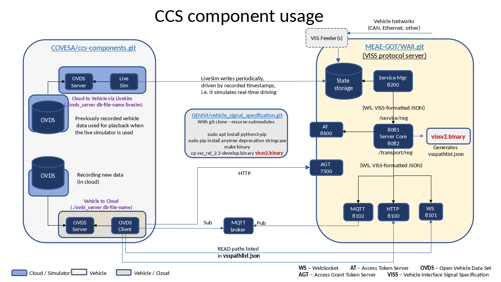

# ccs-components
This project contains a number of components used in the Cloud & Connected Services (CCS) project at the Connected Vehicle Systems Alliance (COVESA).
The figure below shows an example of this technology stack, where the components on this repo are used.

  

Please note that in the Git deployment model figure the same OVDS DB and server are shown representing both a cloud deployment, and a vehicle deployment.
The Technology stack figure shows them separated, which is how it is used in the CCS project when vehicle data is simulated. In a vehicle deployment the live simulator, the OVDS server and database would be replaced by a "vehicle native" data feeder implementation. 
The VISSv2 internal interfaces between the core server, the HTTP/WS/MQTT transport managers, and the service manager all run over the Websocket protocol, with JSON payloads as specified for the Websocket transport in the VISSv2 specification. 
The statestorage interface is realized by the SQLITE queries that can be formulated to read or write single signals from/to it.

# OVDS server/db
The Open Vehicle Data Set database is a database schema that is well suited for storing vehicle data from multiple vehicles. 
It is here realized on an SQLite DB. 
The OVDS server exposes an HTTP interface for reading from, or writing to the OVDS.

# OVDS/CCS Client
The OVDS/CCS client reads data from the VISSv2 server over HTTP or Websocket transports, and writes it to the OVDS via the OVDS server.

# VISSv2-server
The VISSv2 server is not developed on this repo, it is found on https://github.com/MEAE-GOT/WAII.

# statestorage DB
The statestorage database is used as a buffer between the two asynchronous systems north- and southbound of it.
It contains a single entry for each signal of the VSS tree that is used to represent the signals of this vehicle. 

# live simulator
The live simulator has been developed to solve the problem of simulating a stream of vehicle signals to feed into the technology stack.
The source of the vehicle data is an OVDS that has been populated with vehicle data that has been obtained from real life vehicle trips.
The live simulator reads the OVDS data via an OVDS server, and writes it to a statestorage DB. 
The timing of this read/write process is controlled by the timestamps of the data in the OVDS.

# OVDS server/db (livesim)
This component is used as the vehicle data source for the live simulator. 
It is functionally equivalent with the OVDS server/db described earlier. 

For detailed information about these components, please see the README in respective directory.

